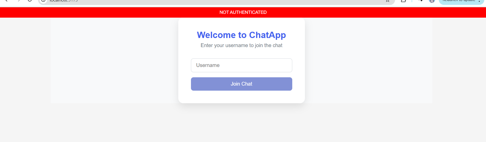
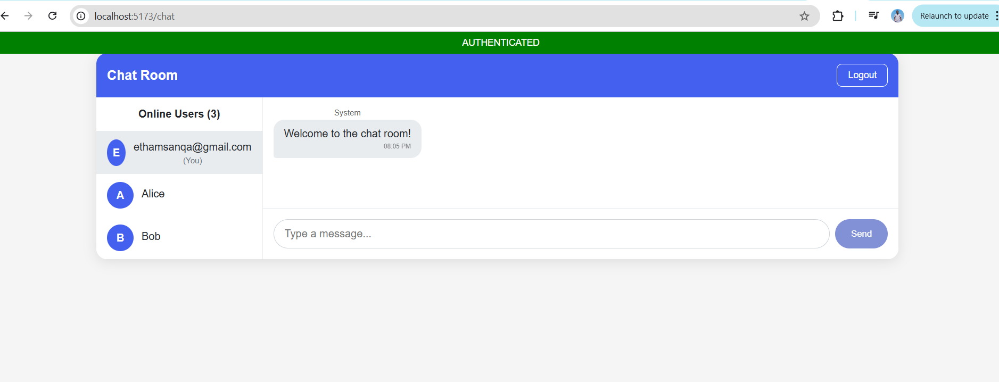

# Real-Time Chat Application with Socket.io

This assignment focuses on building a real-time chat application using Socket.io, implementing bidirectional communication between clients and server.

##  Features
✅ Real-time messaging – Instant message delivery between users.
✅ User authentication – Simple username-based login.
✅ Typing indicators – Shows when a user is typing.
✅ Online/offline status – Tracks active users.
✅ Private messaging – Direct one-on-one chats.
✅ Notifications – Alerts for new messages and user activity.
✅ Responsive design – Works on desktop and mobile.

##  Setup & Installation
Prerequisites
Node.js (v18+ recommended)
npm or yarn
MongoDB (for storing messages & user data)


1. Clone the Repository

git clone https://github.com/PLP-MERN-Stack-Development/week-5-web-sockets-assignment-ThamsanqaEmmanuel.git
cd week-5-web-sockets-assignment-ThamsanqaEmmanuel

2. Install Server Dependencies

cd server
npm install

3. Install Client Dependencies

cd ../client
npm install

4. Configure Environment Variables

## Create a .env file in the server directory:

env
PORT=5000
MONGO_URI=mongodb://localhost:27017/chat-app
JWT_SECRET=your-secret-key

5. Run the Application

## Start the server:

cd ../server
npm run dev
Start the client:


cd ../client
npm run dev

Server: Runs on http://localhost:5000

Client: Runs on http://localhost:5173


## Project Structure

Client/
src/
├── components/
│   ├── MessageList.jsx       # Displays chat messages
│   ├── MessageInput.jsx      # Handles message input
│   ├── TypingIndicator.jsx   # Shows typing status
│   └── UserList.jsx          # Lists online users
├── pages/
│   ├── Login.jsx             # User login page
│   ├── ChatRoom.jsx          # Main chat interface
│   └── PrivateChat.jsx       # Private messaging
├── services/
│   └── api.js               # API calls (if using REST)
├── context/
│   └── SocketProvider.jsx    # Manages Socket.io connection
├── App.jsx                   # Main app router
└── socket.js                 # Socket.io client setup```

server/
├── controllers/
│   ├── authController.js     # Handles login/logout
│   ├── messageController.js  # Manages messages
│   └── userController.js     # Tracks online users
├── models/
│   ├── User.js               # User schema
│   └── Message.js           # Message schema
├── routes/
│   ├── authRoutes.js        # Authentication routes
│   └── messageRoutes.js     # Message API routes
├── sockets/
│   └── socketHandler.js     # Socket.io event handlers
├── config/
│   └── db.js               # MongoDB connection
├── server.js               # Express + Socket.io server
└── .env                    # Environment variables

## Getting Started

1. Accept the GitHub Classroom assignment invitation
2. Clone your personal repository that was created by GitHub Classroom
3. Follow the setup instructions in the `Week5-Assignment.md` file
4. Complete the tasks outlined in the assignment

## Files Included

- `Week5-Assignment.md`: Detailed assignment instructions
- Starter code for both client and server:
  - Basic project structure
  - Socket.io configuration templates
  - Sample components for the chat interface

## Requirements

- Node.js (v18 or higher)
- npm or yarn
- Modern web browser
- Basic understanding of React and Express

## Screenshots




## Resources

- [Socket.io Documentation](https://socket.io/docs/v4/)
- [React Documentation](https://react.dev/)
- [Express.js Documentation](https://expressjs.com/)
- [Building a Chat Application with Socket.io](https://socket.io/get-started/chat) 